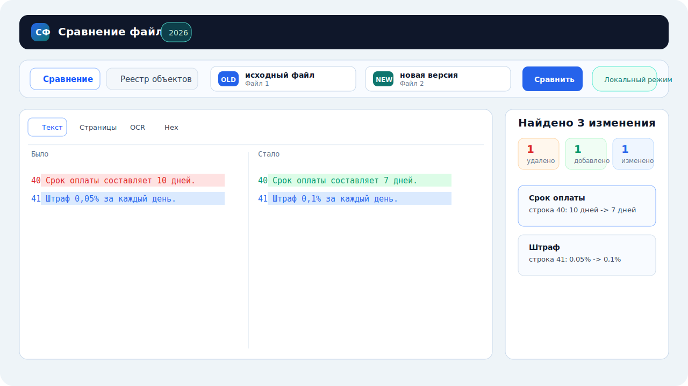
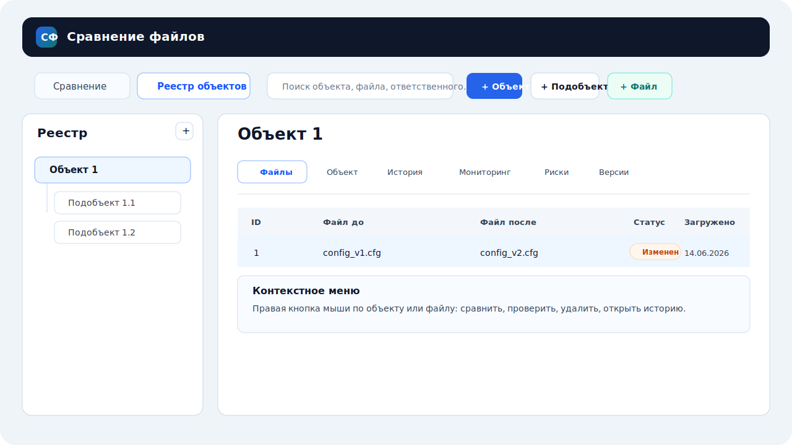
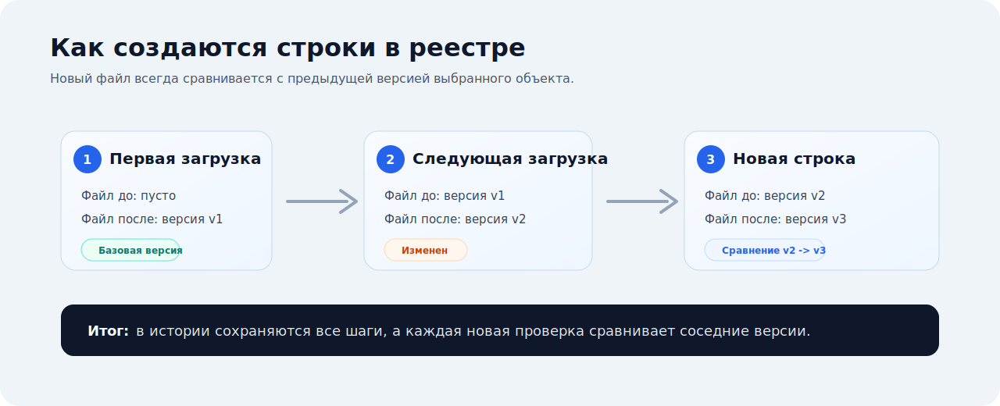

# Сравнение файлов

Локальное Windows-приложение на Python для сравнения документов, конфигурационных файлов, PDF, Excel, изображений, KLP-файлов Kaspersky и неизвестных бинарных форматов.



## Что умеет программа

- сравнивает файлы в локальном режиме: было, стало, строка, тип изменения;
- ведет реестр объектов и подобъектов без ограничения глубины;
- хранит локальную SQLite-базу рядом с исполняемым файлом при сборке в exe;
- сравнивает новый файл с предыдущей версией внутри выбранного объекта;
- показывает историю, мониторинг, версии, риски и статусы проверки;
- обрабатывает config-файлы и KLP-файлы Kaspersky более информативно;
- экспортирует отчет с русскими типами изменений: удалено, добавлено, изменено;
- работает локально и не отправляет содержимое файлов в сеть.

## Быстрый старт

```powershell
python -m venv .venv
.\.venv\Scripts\python -m pip install -e ".[dev]"
.\.venv\Scripts\python main.py
```

Если запускаете из PyCharm, откройте проект `PythonSverkaVsego` и запускайте файл `main.py`.

## Инструкция

Подробная инструкция с иллюстрациями находится здесь:

[docs/USER_GUIDE.md](docs/USER_GUIDE.md)

PDF-версия в современном стиле с иллюстрациями:

[docs/USER_GUIDE.pdf](docs/USER_GUIDE.pdf)

## Сборка exe

```powershell
.\.venv\Scripts\python -m pip install -e ".[dev]"
.\.venv\Scripts\pyinstaller packaging\file-compare-app.spec --clean
```

Готовый файл появится в папке `dist`:

```text
dist\Сравнение файлов.exe
```

Иконка exe берется из `packaging/sf.ico`, а параметры сборки находятся в `packaging/file-compare-app.spec`.

## Реестр объектов



В режиме реестра программа позволяет создать объект, добавить любое количество подобъектов, загрузить файл и дальше вести цепочку версий. При повторной загрузке создается новая строка: предыдущий файл после становится файлом до, а новый файл записывается в файл после.

## Принцип версий



Такой подход удобен для постоянного контроля: каждый новый файл сравнивается не с самым первым, а с последней принятой версией.

## OCR

Python-библиотека `pytesseract` входит в зависимости, но сам движок Tesseract устанавливается отдельно в Windows. Если `tesseract.exe` не найден в `PATH`, приложение продолжит работать, а OCR будет отмечен как недоступный в диагностике.

## Приватность

Репозиторий не должен содержать реальные конфиги, KLP-файлы, базы данных, отчеты, сборки exe и локальные настройки IDE. Для этого в `.gitignore` добавлены правила, которые исключают такие файлы из публикации.

## Лицензия

Проект распространяется по лицензии MIT. Подробности в файле [LICENSE](LICENSE).
